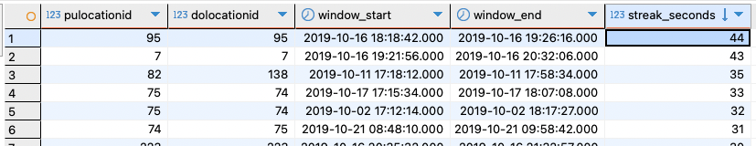

Question 1: Redpanda version
rpk version v24.2.18 (rev f9a22d4430)

Question 2. Creating a topic

rpk topic create green_data
TOPIC STATUS
green_data OK

Question 3. Connecting to the Kafka server
Provided that you can connect to the server, what's the output of the last command?
True

Question 4: Sending the Trip Data
How much time did it take to send the entire dataset and flush?
33.34

Question 5
95 -> 95

